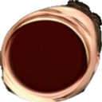

  

<h1 align="center">OMEGALUL Counter</h1>

    <b>Counts OMEGALUL emotes used while a streamer is live and saves it to a Firebase realtime database.</b>
     
    <b>Written in Typescript, using Node.</b>

    
    

    Fork and create a <code>config.json</code> file within the config directory using the example file and fill it out to the best of your ability.
     
     
    You will need to setup a Firebase realtime database, and use the credentials from it. You will also need to create a Twitch app, and use the client ID and secret from it.
     
     
    Get the user ID of the twitch streamer of your choice and put it in the config. By default, this app measures the OMEGALUL emote, but can measure any enabled 7tv emote in the channel.
     
     
    In development, this uses nginx to automatically generate SSL and receive webhook events from twitch, but you will want to setup the webhook with or without reverse proxy yourself for production.

